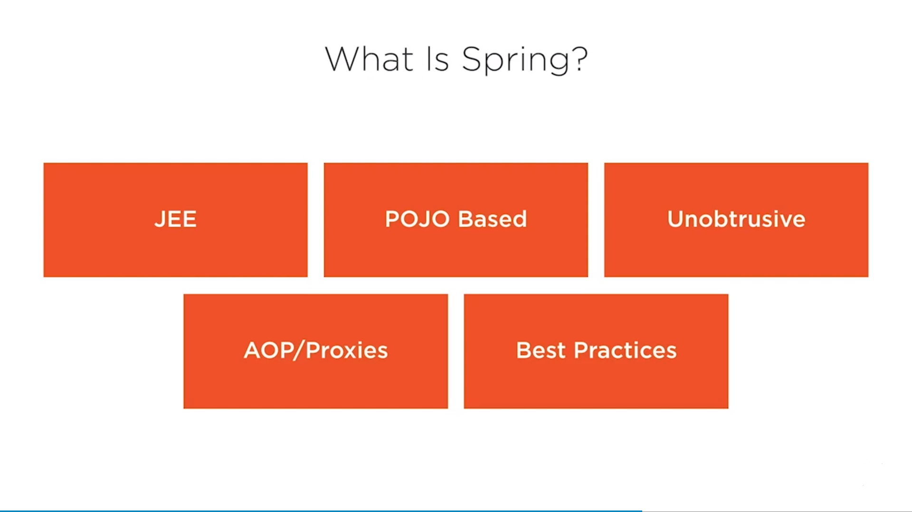
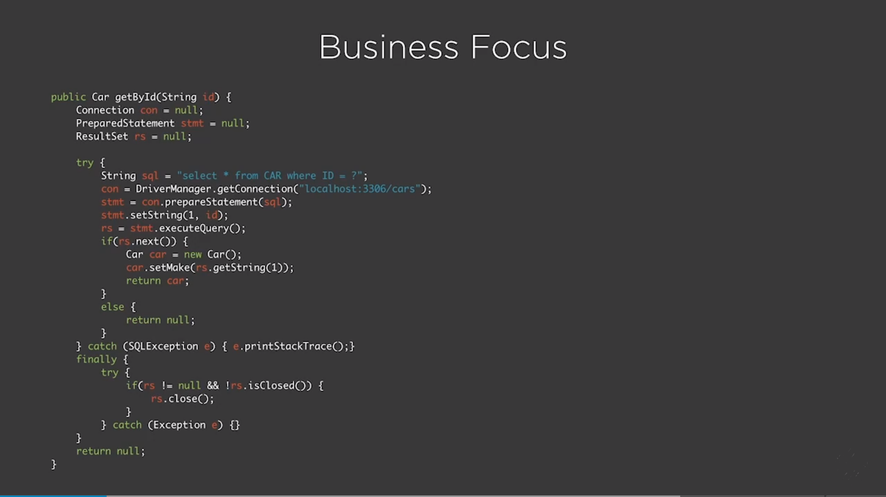
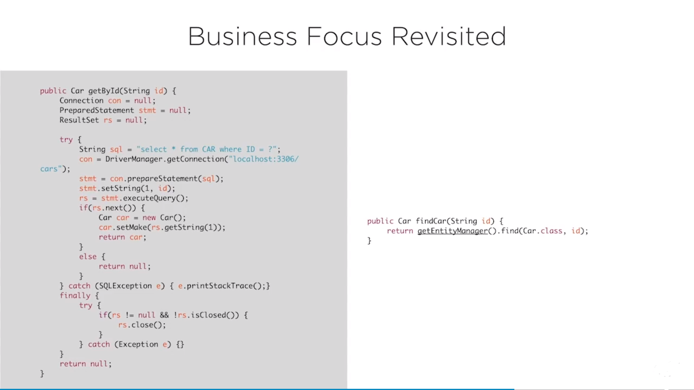

# Spring Fundamentals
This practice project follows Pluralsight course https://app.pluralsight.com/player?course=spring-framework-spring-fundamentals 

#Topics Covered

1) Java Configuration
2) Autowiring
3) Advanced Bean Configuration

# What is Spring ?
Started with <b>Inversion of Control Container</b>, this technique is often considered as <b>Dependency Injection</b>.
It was conceived to reduce or replace some complex configuration of earlier JavaEE.
Spring started to reduce usage of EJBs (Enterprise Java Beans).

Dependecy Injection 
------------------- 
Simply removing hardcoded wiring from your app and using a framework to inject dependency resources where they are needed.

 

The Problems solved by Spring
------------------------------------
1) Testability
2) Maintainability
3) Scalablilty
4) Complexity
5) <b>Business Focus</b>

Lets take an example how <b>Business Focus</b> is acheived:

 

The Solution 
------------

1) Configuration - remove config. code or loopkup code
2) Focus - how I handle exception? these things are resolved
3) Testing
4) Annotation or XML Based
5) Interface Based - makes things easier to test.

Let's revisit the Business Focus Problem, and we can see that for fetching the details of a Car we need to write whole connection opening, sql query execution, collect result from resultSet and finally close the connection.
Now for simple business use case for fetching details of Car remaining code considered as boilerplate.

Let's take a look - 

 
This is the usage of template method pattern of Spring. But take a look of how concise a code is now.

How it Works ?
--------------

Spring can be considered as 
1) <b>POJOe</b> (Plain Old Java Object). 
2) <b>HashMap - ApplicationContext</b> - is the configured application container where all the application depedencies wired up at it.
3) Can also be used as <b>Registry</b>