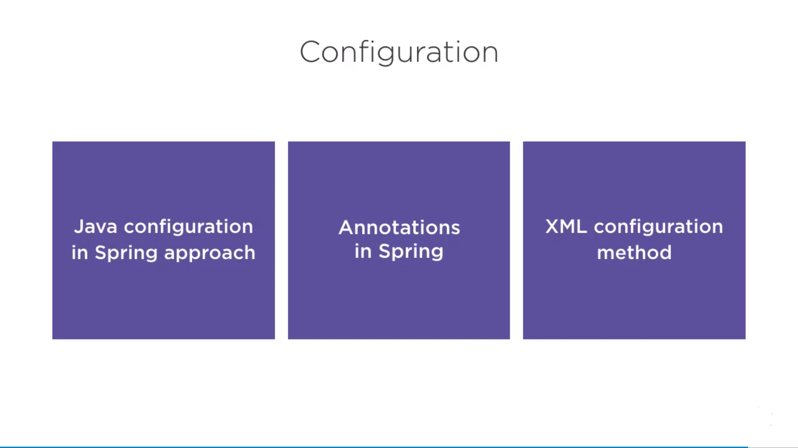

# Spring Fundamentals
This practice project follows [Pluralsight course](https://app.pluralsight.com/player?course=spring-framework-spring-fundamentals )

Topics Covered
--------------

1) Java Configuration
2) Autowiring
3) Advanced Bean Configuration

What is Spring ?
----------------

Started with <b>Inversion of Control Container</b>, this technique is often considered as <b>Dependency Injection</b>.
It was conceived to reduce or replace some complex configuration of earlier JavaEE.
Spring started to reduce usage of EJBs (Enterprise Java Beans).

Dependecy Injection 
------------------- 
Simply removing hardcoded wiring from your app and using a framework to inject dependency resources where they are needed.


 


The Problems solved by Spring
------------------------------------
1) Testability
2) Maintainability
3) Scalablilty
4) Complexity
5) <b>Business Focus</b>

Lets take an example how <b>Business Focus</b> is acheived:

 

The Solution 
------------

1) Configuration - remove config. code or loopkup code
2) Focus - how I handle exception? these things are resolved
3) Testing
4) Annotation or XML Based
5) Interface Based - makes things easier to test.


Let's revisit the Business Focus Problem, and we can see that for fetching the details of a Car we need to write whole connection opening, sql query execution, collect result from resultSet and finally close the connection.
Now for simple business use case for fetching details of Car remaining code considered as boilerplate.

Let's take a look - 


 
This is the usage of template method pattern of Spring. But take a look of how concise a code is now.


How it works?
--------------

Spring can be considered as 
1) <b>POJOe</b> (Plain Old Java Object). 
2) <b>HashMap - ApplicationContext</b> - is the configured application container where all the application depedencies wired up at it.
3) Can also be used as <b>Registry</b>


Why Spring?
------------
Spring was developed to make existing tasks easier.
Before it we used some design patterns from <b>JEE Blueprints</b> that helped us write better code and establish repeatable processes these blueprints helped to establish consistent way of doing things but still made code brittle and untestable. We need often need to change the images, urls and some configurations but due to tight coupled code it could not be possible to do so, this problem called as <b>WORA (Write once and Run Anywhere)</b>.
We want actual implementation not hardcoded inside application. 
This is what Spring Framework will help us to do. 


Demo
-----
Lets have a Demo '[Confrenence App](https://github.com/yogiseralia/SpringDemoConfrenceApp)' to understand what it is when spring is not used? 
And later how is this app configured with Spring?


Configuration
-------------
Spring is about removing cofiguration from code. 
Why configuration is bad? because 
1) it makes things brittle, 
2) of Testing Difficulties.

Now we will use Spring to do configurations with three approach using demo -
 


1- Spring Configuration Using Java
-------------------------------

Some People don't like mixing xml and source code together for configuration. We will take the smaple app wired up with Java and do 

Key points- 

<b>No applicationContext.xml</b> - but we still have context just not configured in XML. Earlier there was <b>too much XML</b> code in place that people thought to be XML developer not a Java developer. Then <b>Namespace</b> helped a bit but developers wanted less or no XML.
then Java configuration was introduced and now at latest everything is available in Java in terms of configuration.


@Configuration
--------------

applicationContext is replaced by **@Configuration**

**@Configuration** is applied at class level

Spring Bean is defined by **@Bean**

**@Bean** is applied at method level

For e.g. - 

````java
import org.springframework.context.annotation.Bean;
import org.springframework.context.annotation.Configuration;

@Configuration
public class AppConfig {

    @Bean(name = "speakerService")
    public SpeakerService getSpeakerService(){
        return new SpeakerServiceImpl();
    }
}
````


**NOTE** - All beans created via **@Bean** annotation created only once, hence also called as **Singleton**  
 
Setter Injection
----------------
 Simple as a method call.

 A lot "Mystery" of injection goes away when using it.

 Setter injection simply calling a setter on a bean. 
 
 For e.g. - 

AppConfig.java -  
 ````java

import org.springframework.context.annotation.Bean;
import org.springframework.context.annotation.Configuration;

@Configuration
public class AppConfig {

    @Bean(name = "speakerService")
    public SpeakerService getSpeakerService() {
        SpeakerServiceImpl speakerService = new SpeakerServiceImpl();
        // using setter method to resolve dependency
        speakerService.setSpeakerRepository(getSpeakerRepository());
        return speakerService;
    }

    @Bean(name = "speakerRepository")
    public SpeakerRepository getSpeakerRepository() {
        return new HibernateSpeakerRepositoryImpl();
    }
}

````

SpeakerService using setter method for SpeakerRepository.java
````java

public class SpeakerServiceImpl implements SpeakerService {

    private SpeakerRepository speakerRepository;

    @Override
    public List<Speaker> findAll() {
        return speakerRepository.findAll();
    }

    // this setter used in above code snippet to resolve the dependency
    public void setSpeakerRepository(SpeakerRepository speakerRepository) {
        this.speakerRepository = speakerRepository;
    }
}
```` 
 